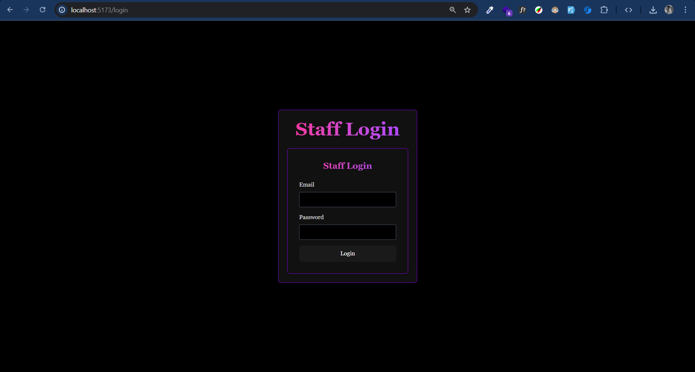
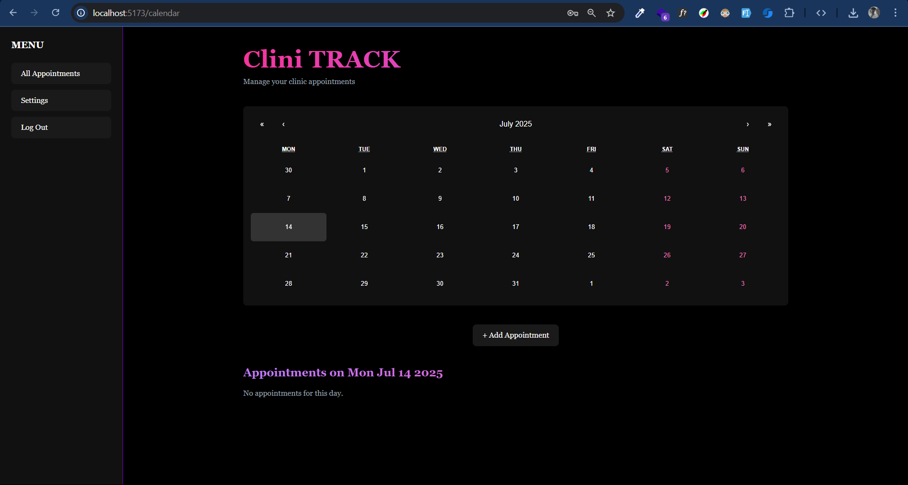
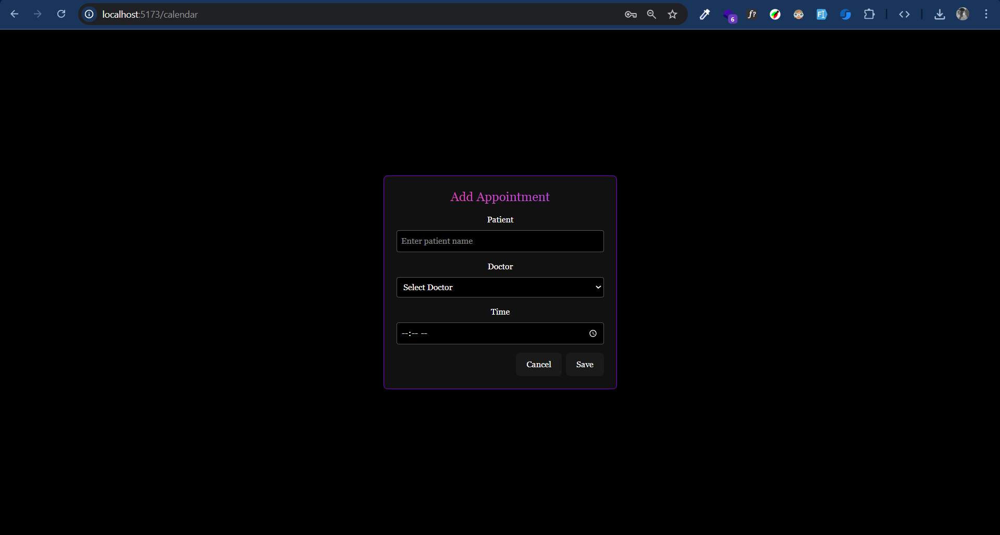
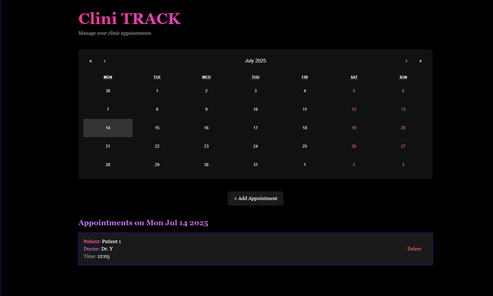
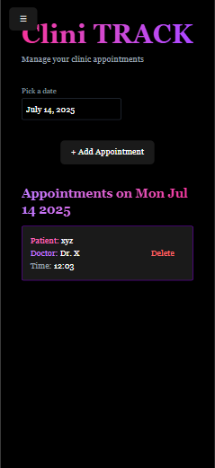
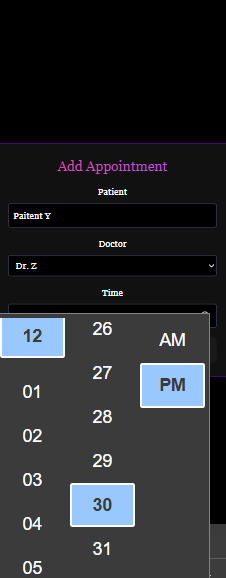
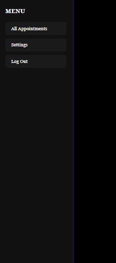

# CliniCal 🩺

A responsive clinic appointment dashboard built with React. Designed to manage appointments day-by-day with a clean UI, modal form, and localStorage persistence.

## 🚀 Features

- 🌗 Dark mode layout
- 🗓 Calendar view (desktop) + date picker (mobile)
- 📅 Add & delete appointments
- 💾 Saved locally via `localStorage`
- 📱 Mobile responsive with collapsible sidebar
- ✅ Simple staff login (`jaasim@gmail.com / 123456`)

## 🖼 Demo Screenshots

-Desktop View






-Mobile View




## 🔧 Tech Stack

- React + Vite
- TailwindCSS
- React Calendar
- React DatePicker
- localStorage (for persistence)

## 📲 Login Credentials

Use these to access the app:

```bash
Email: jaasim@gmail.com
Password: 123456


🛠️ Setup Instructions

git clone https://github.com/your-username/clinical.git
cd clinical
npm install
npm run dev

📁 Folder Structure

src/
 ├── components/
 │    ├── LoginForm.jsx
 │    ├── Sidebar.jsx
 │    ├── AppointmentModal.jsx
 │    └── CalendarWidget.jsx
 ├── pages/
 │    ├── LoginPage.jsx
 │    └── CalendarPage.jsx
 ├── styles/
 │    └── calendar.css
 ├── App.jsx
 └── main.jsx

